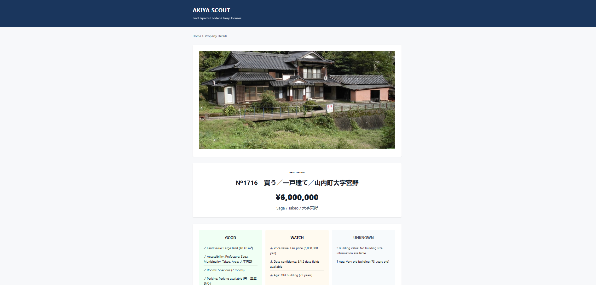
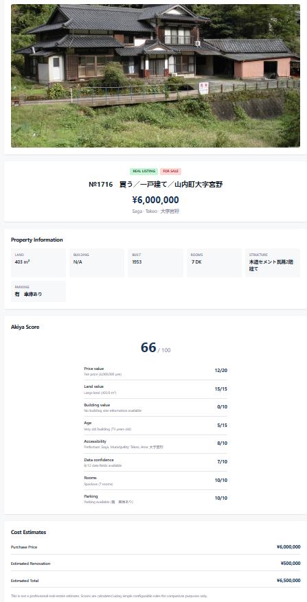

# Akiya Scout

Find cheap houses in rural Japan.

Akiya Scout pulls real property listings directly from public municipal Akiya bank websites. Search, filter, compare, and estimate total costs before contacting sellers—no database, no accounts, just real listings from real sources cached for 10 minutes.

---

## Screenshots

### Search Results


### Property Details


---

## Features

- Searches public municipal Akiya banks
- Separates For Sale and For Rent listings
- Filters by price, land size, building size, room count, and parking
- Scores each property 0–100 (Akiya Score)
- Estimates renovation and total costs
- Side-by-side comparison of 2–3 properties
- Direct links back to original listings

---

## Current Sources

| Source | Area | Type | Status |
| --- | --- | --- | --- |
| Takeo City | Saga | For Sale | Active |
| Aso City | Kumamoto | For Rent | Active |

**Note:** Some sources block automated access. We respect that policy and don't scrape sites we can't access fairly.

---

## Getting Started

**Requirements:** Python 3.12+, Windows PowerShell

```powershell
git clone https://github.com/BistaDinesh03/akiya-scout.git
cd akiya-scout
python -m venv venv
.\venv\Scripts\Activate.ps1
pip install -r requirements.txt
uvicorn app.main:app --reload
```

Then open: http://127.0.0.1:8000

---

## API

### Endpoints

| Endpoint | Purpose |
| --- | --- |
| `GET /api/properties` | Search and filter listings |
| `GET /api/sources` | List active sources |
| `GET /api/compare?ids=a,b` | Compare properties side by side |
| `GET /health` | Health check |
| `GET /api/docs` | Interactive API documentation |

### Example Request

```
GET /api/properties?listing_type=SALE&max_price=5000000&sort=price_asc
```

---

## Configuration

| Variable | Default | Purpose |
| --- | --- | --- |
| `CACHE_TTL_SECONDS` | 600 | Listing cache duration in seconds |
| `AKIYA_ALLOW_INSECURE_SSL` | false | Development only; keep false in production |

---

## Testing

```powershell
python -m pytest
```

**Status:** 163+ tests passing

---

## Adding a Source

1. Create a new file in `app/scrapers/sources/`
2. Extend `BaseScraper`
3. Implement: `get_source_name()`, `fetch()`, `parse()`, `normalize()`
4. Register it in `app/scrapers/registry.py`

That's it!

---

## Guidelines

- Public sources only
- Respect `robots.txt`
- No bypassing CAPTCHA or login walls
- Preserve original listing links
- No fake data, ever

---

## Disclaimer

Akiya Scout is a research tool. It does not verify ownership, condition, legality, or availability. Scores and cost estimates are rough guides, not professional advice. Always conduct your own due diligence before any purchase.

---

## License

MIT. See `LICENSE.txt`.